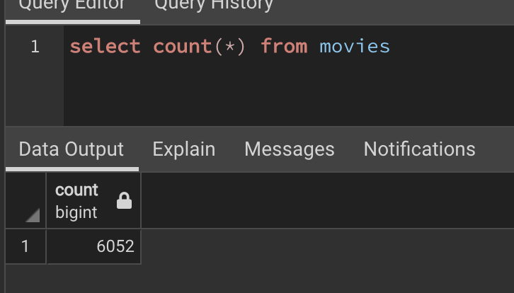
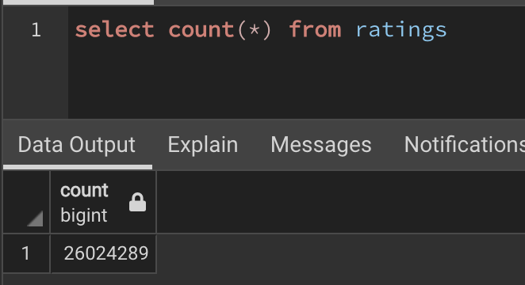

# Movies-ETL

## Overview of the analysis:

Our goal is to create an automated pipeline that takes in new data, performs the appropriate transformations, and loads the data into existing tables.  

We will create one function that takes in the following three files and then performs the ETL process by adding the data to a PostgreSQL database.
- Wikipedia data
- Kaggle metadata
- MovieLens rating data

## Results:
After performing our ETL process we have 6,052 records in our Movies Table
 * Movies Query
 
 

After performing our ETL process we have 26,024,28 records in our Ratings Table

* Ratings Query
 
  
